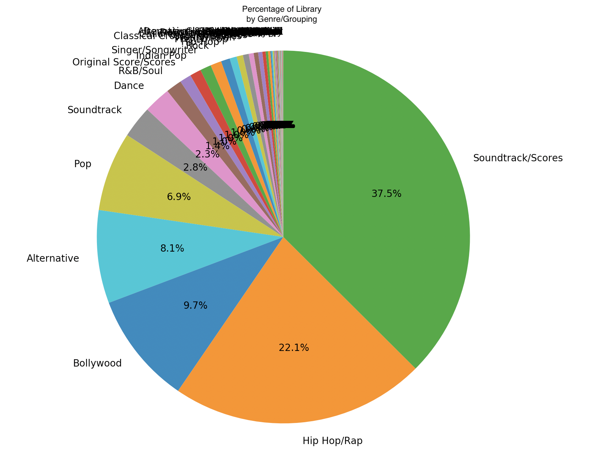
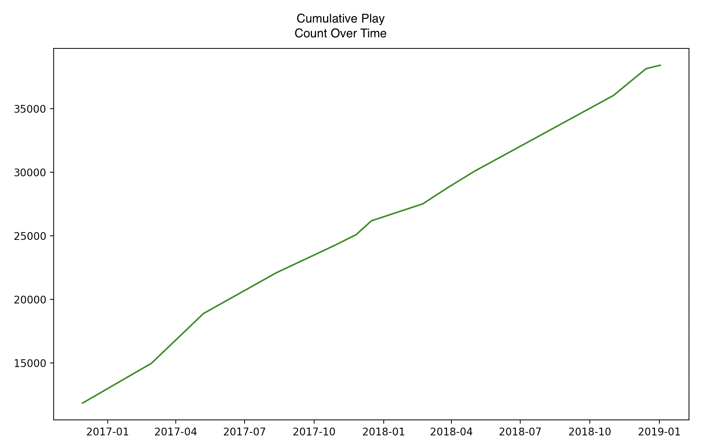
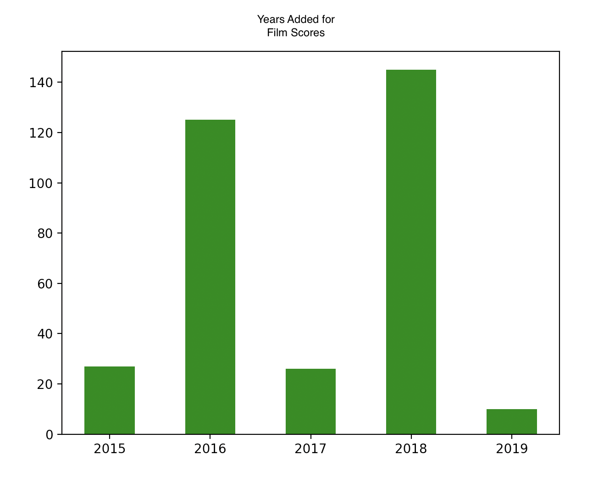
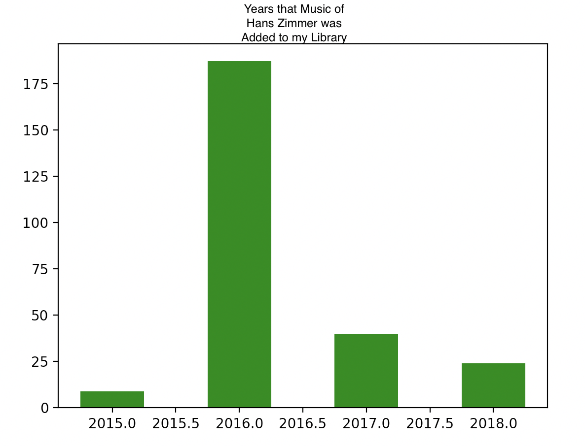
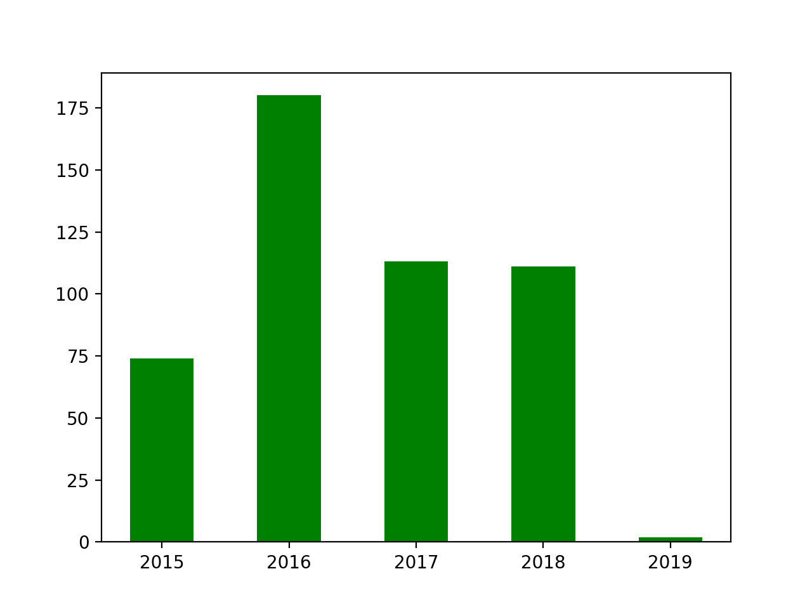
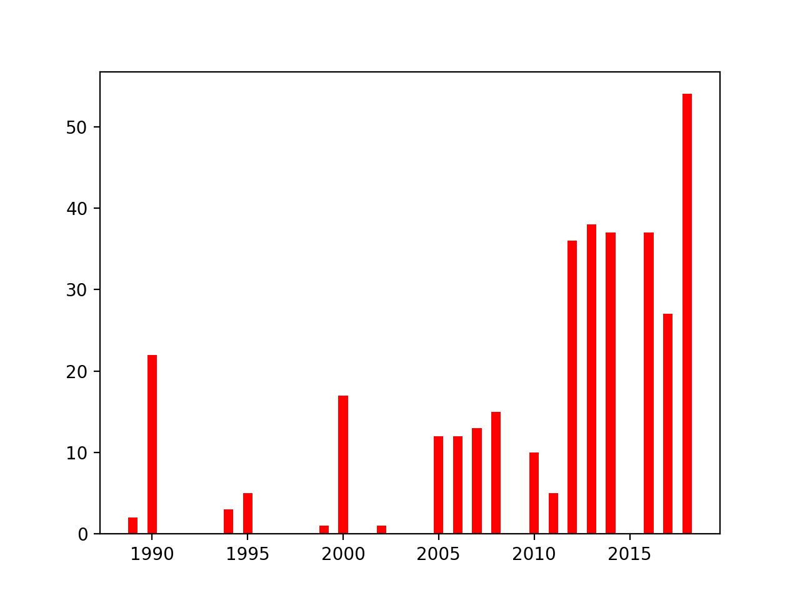

# A Python Apple Music Analysis
## Getting the data
If you're an Apple Music User, or use iTunes to maintain your primary library, this script gives a simple way to visualize a couple of primitive statistics. To get the xml file with the information you want, turn on xml sharing in the iTunes preferences.

## Processing the Data
To actually make use of the resulting xml, we have to parse it down, a little bit manually because of the key value pair format that iTunes uses. You can quickly scan through parse.py to see how I accomplish this. (P.S. It's a lot of if statements)

Then, I add all the songs to a list, and each song is maintained as a python dictionary, so it can easily be converted to JSON for internet sharing, or can be used for other data processing techniques.

## Analyzing the Data
To analyze, for now I have only put in a few simple methods.
1) Genre Pie Chart

2) Genre and Grouping Pie Chart

3) Bar Chart of Years Added

4) Bar Chart of Years Songs Were Written

### Changes Over Time
Once you start keeping track of multiple files over time, you can track some of the deltas using the 'load_all' function. One example of this is the 'plot_play_count' function, which takes in a list of pickle files that have been processed.
1) Plot Play Count

This function shows plays over time using the play counts of individual songs and summing them for a total in each xml library file. The total play count is stored as a library attribute in the pkl. Eventually, we can also filter these play counts (albeit with more processing) and limit which categories contribute to the plays.

### Using Filters
You can build a filter function by calling 'single_filter()' or 'multi_filter()' functions. Then, you can pass these filters in to the processing functions to narrow down results.
Some examples of code and results are shown below.
1) Count of Scores Added to Library  
'plot_years_added(o, True, single_filter('Grouping', 'Scores'))'

2) Count of Music by Hans Zimmer Added to Library  
'plot_years_added(o, True, single_filter('Artist', 'Hans Zimmer', contains=True))'

3) Count of Bollywood Music Added to Library  
'plot_years_added(o, True, single_filter('Genre', 'Bollywood'))'

4) Count of Music by Hans Zimmer or Alan Silvestri by the Year Made  
'plot_years_made(o, True, multi_filter('Artist', ['Hans Zimmer', 'Alan Silvestri'], contains=True))'

