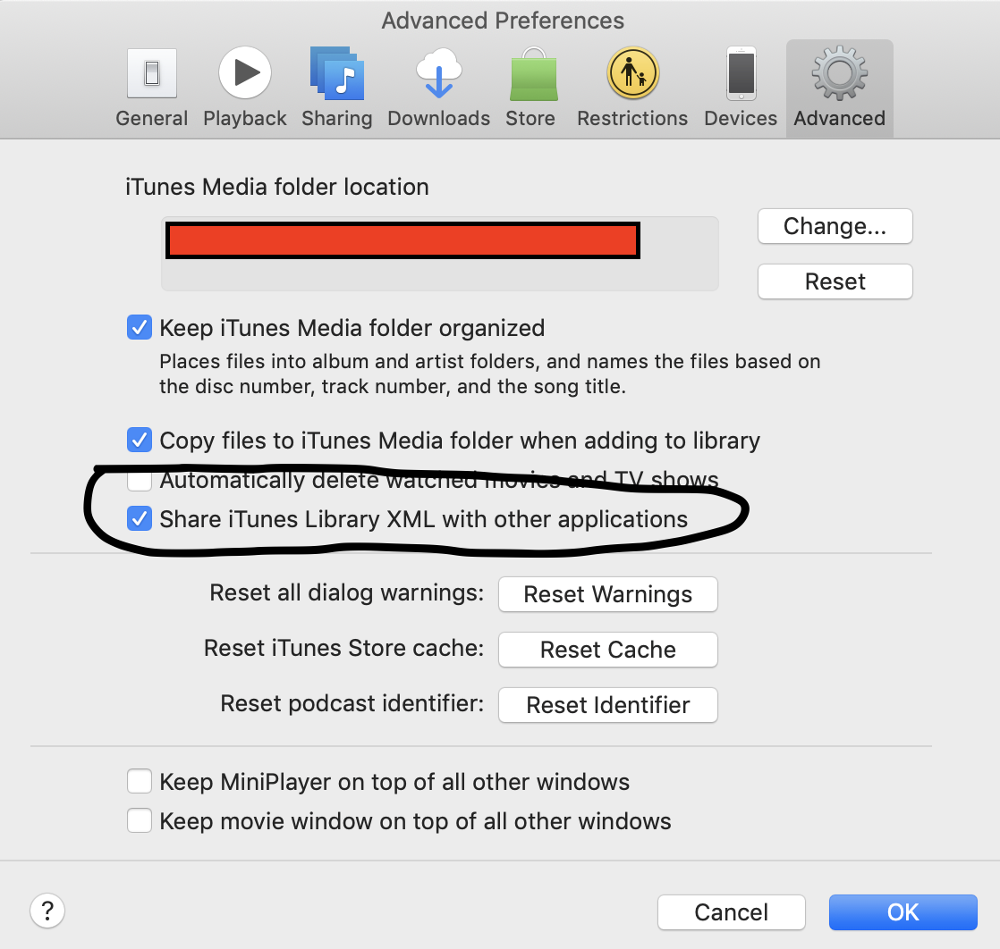
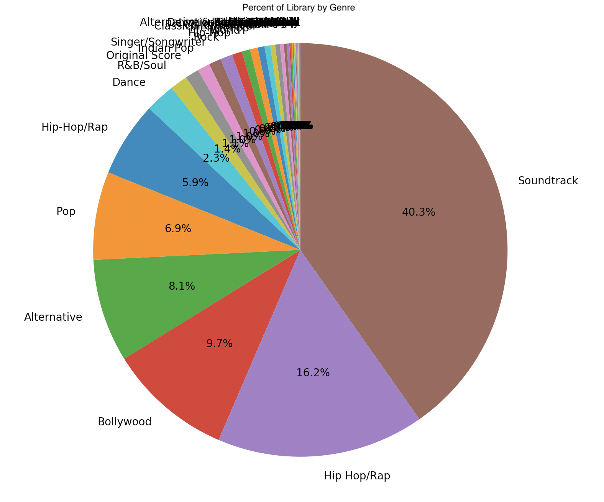
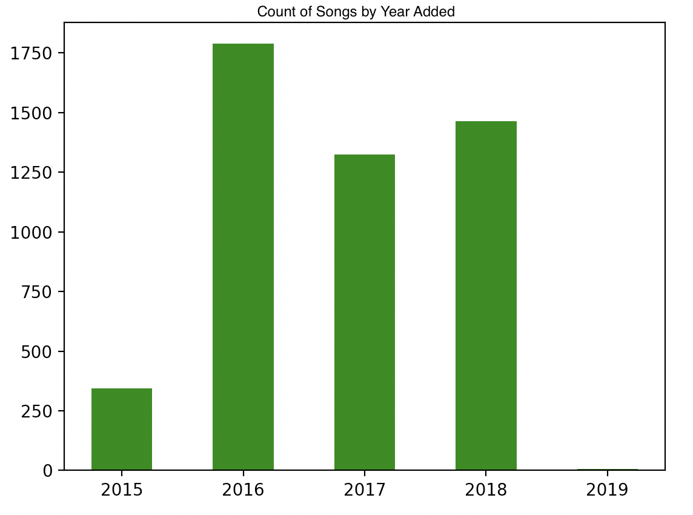
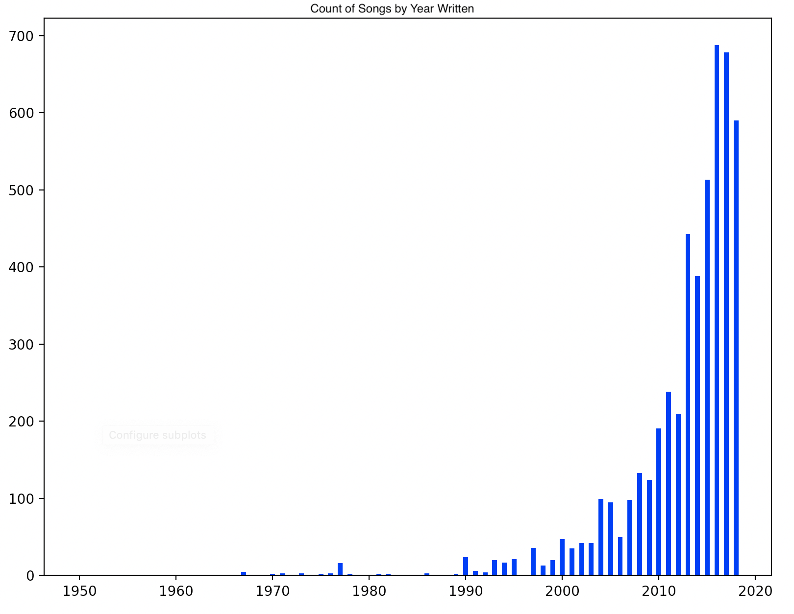

# A Python Apple Music Analysis
## Getting the data
If you're an Apple Music User, or use iTunes to maintain your primary library, this script gives a simple way to visualize a couple of primitive statistics. To get the xml file with the information you want, turn on xml sharing in the iTunes preferences.

## Processing the Data
To actually make use of the resulting xml, we have to parse it down, a little bit manually because of the key value pair format that iTunes uses. You can quickly scan through parse.py to see how I accomplish this. (P.S. It's a lot of if statements)

Then, I add all the songs to a list, and each song is maintained as a python dictionary, so it can easily be converted to JSON for internet sharing, or can be used for other data processing techniques.

## Analyzing the Data
To analyze, for now I have only put in a few simple methods.
1) Genre Pie Chart

2) Bar Chart of Years Added

3) Bar Chart of Years Songs Were Written

